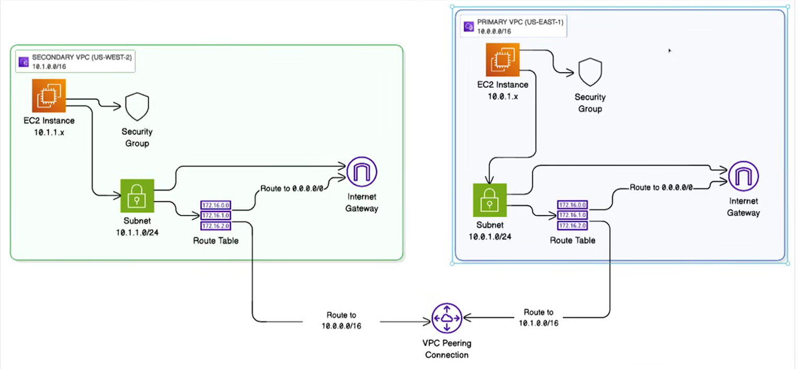
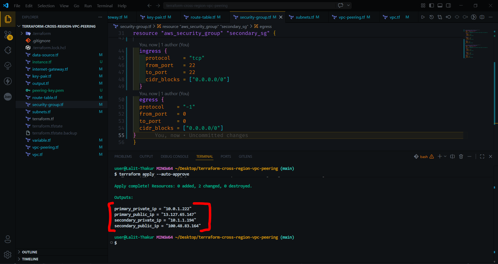

# 🌐 Terraform Multi-Region VPC Peering Project

## 📌 Overview

This project demonstrates how to set up **VPC Peering between two AWS regions** using Terraform.
Two EC2 instances are deployed in separate VPCs across regions, and connectivity is verified using **private IP ping**.

---

## 🏗️ Architecture Diagram

<p align="center">
  
</p>

> This diagram shows cross-region VPC peering, route tables, subnets, and EC2 communication flow.

---

## 📸 Project Screenshots

### 🔹 Terraform Apply Output



> Infrastructure successfully created using Terraform.

---

### 🔹 EC2 Instances Running


> Instances deployed in both regions with public IP enabled.

---

### 🔹 Successful Cross-Region Ping (Private IP)


> Demonstrates successful communication between EC2 instances using **private IP via VPC Peering**.

---

## 🏗️ Architecture Details

### 🌍 Regions Used

* **Primary Region:** ap-south-1 (Mumbai)
* **Secondary Region:** us-east-1 (N. Virginia)

---

### 🔹 VPC Configuration

| VPC       | CIDR        | Region     |
| --------- | ----------- | ---------- |
| Primary   | 10.0.0.0/16 | ap-south-1 |
| Secondary | 10.1.0.0/16 | us-east-1  |

---

### 🔹 Subnets

| Subnet           | CIDR        |
| ---------------- | ----------- |
| Primary Subnet   | 10.0.1.0/24 |
| Secondary Subnet | 10.1.1.0/24 |

---

### 🔹 Route Tables

Each route table includes:

* Internet access:

```
0.0.0.0/0 → Internet Gateway
```

* Peering routes:

```
Primary → 10.1.0.0/16 → VPC Peering
Secondary → 10.0.0.0/16 → VPC Peering
```

---

### 🔹 Security Groups

* Allow SSH (port 22)
* Allow ICMP (ping)
* Allow all outbound traffic (required for return traffic)

---

## 🔗 VPC Peering

* Request initiated from Primary VPC
* Accepted in Secondary Region
* Cross-region communication enabled

---

## 🖥️ EC2 Instances

* Ubuntu 22.04 AMI
* Instance type: `t2.nano`
* Public IP enabled
* SSH access using Terraform-generated key

---

## ⚙️ Setup Instructions

### 1️⃣ Initialize Terraform

```bash
terraform init
```

### 2️⃣ Validate Configuration

```bash
terraform validate
```

### 3️⃣ Apply Configuration

```bash
terraform apply
```

---

## 🧪 Testing Connectivity

### Step 1: SSH into Primary Instance

```bash
ssh -i peering-key.pem ubuntu@<primary-public-ip>
```

### Step 2: Ping Secondary Instance

```bash
ping <secondary-private-ip>
```

---

## 🐞 Issue Faced & Solution

### ❌ Problem

Ping between instances was failing despite correct VPC peering and routing.

### 🔍 Root Cause

Security group was missing **egress (outbound) rules**, blocking ICMP reply traffic.

### ✅ Solution

Added outbound rule:

```hcl
egress {
  protocol    = "-1"
  from_port   = 0
  to_port     = 0
  cidr_blocks = ["0.0.0.0/0"]
}
```

---

## 💡 Key Learnings

* VPC Peering requires **bidirectional routing**
* Security Groups must allow **both inbound and outbound traffic**
* AMIs are region-specific
* Provider configuration is critical in multi-region Terraform
* ICMP requires return traffic (egress) to be allowed

---

## 🧹 Cleanup

To destroy all resources:

```bash
terraform destroy
```

---

## 📁 Project Structure

```
.
├── terraform.tf
├── variable.tf
├── data-source.tf
├── vpc.tf
├── subnets.tf
├── internet-gateway.tf
├── route-table.tf
├── security-group.tf
├── key-pair.tf
├── vpc-peering.tf
├── instance.tf
├── images/
```

---

## 📌 Future Enhancements

* Add private subnets with NAT Gateway
* Use Terraform modules
* Implement multi-AZ deployment
* Add monitoring with CloudWatch

---

## 👨‍💻 Author

**Lalit Kumar**

---

## ⭐ If you like this project, give it a star on GitHub!
